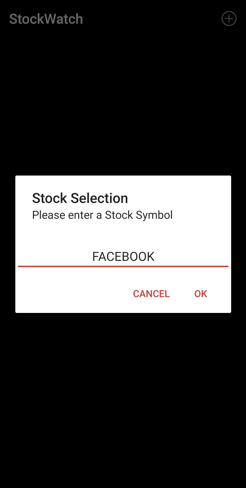
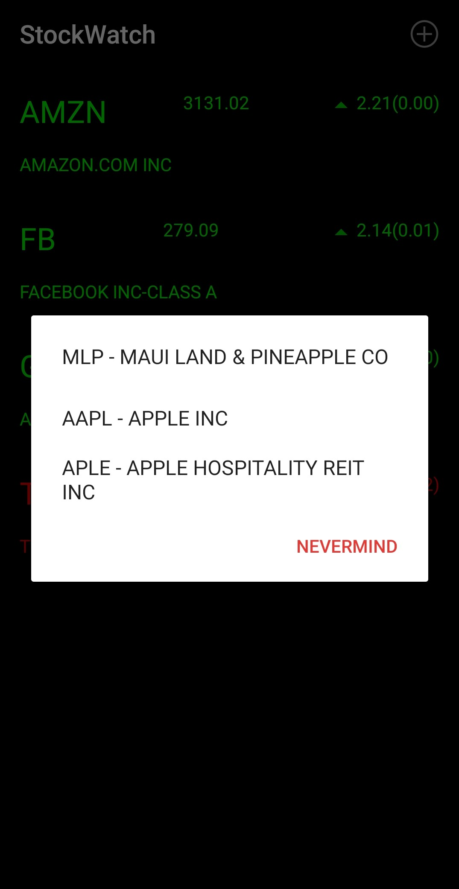
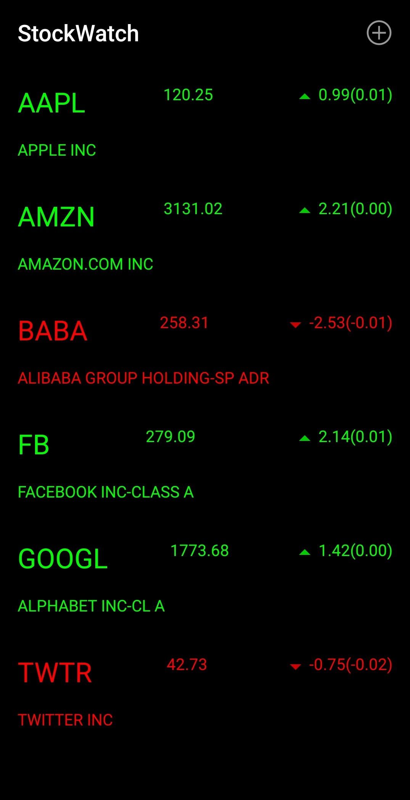
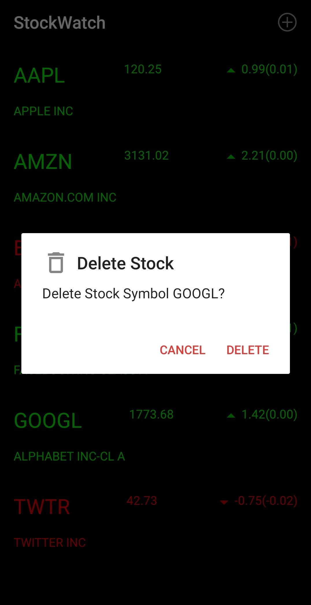

# StockWatch App
An application in which users can keep track their of selected stocks. Users can search for stocks by symbol or name. The list shows the stock symbol, the company name, current price, daily price change and price percent. Positive price changes are displayed in green where as negative price changes are displayed in red. Also includes a pull-down to refresh feature. Developed in Android Studio.

Fetches data from [IEX Cloud](https://iexcloud.io/)

### How to get your API Key:
* Go to: https://iexcloud.io/cloud-login#/register
* Select "Individual"
* Enter your name, email address, and select a password.
* Click the terms checkbox and click "Create acount"
* Select the "START" plan (0/mo) - click Select Start
* Go to your email - look for message with Subject "IEX Cloud Email Verification"
* Click the iexcloud.io link in the email.
* From the page that link opens, click 'API Tokens" in the upper-left (under Home)

### Steps to run:
1. [Get an API Key](#how-to-get-your-api-key) from IEX Cloud
2. In [StockDataDownloader.java](./app/src/main/java/com/example/stockwatch/StockDataDownloader.java) replace `YOUR_API_KEY` with your API key.
3. Run the project through Android Studio.

Created by [Mayank Phadke](https://mayank-phadke.github.io/)

---
## Screenshots

